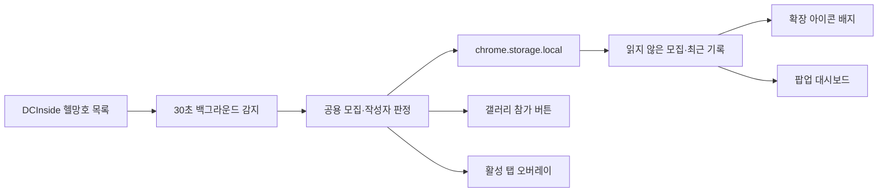

# MANGHO Detector

<p align="center">
  
</p>

<p align="center">
  헬다이버즈 시리즈 갤러리의 <code>헬망호</code> 모집을 감지하고,<br>
  목록 참가 버튼·브라우저 오버레이·읽지 않은 모집 피드로 연결하는 Chrome 확장 프로그램입니다.
</p>

> 현재 버전: **0.9.0** · Manifest V3 · Chrome 120 이상 · 소스 설치 방식

## 빠른 설치

1. GitHub의 `Code` → `Download ZIP`으로 저장소를 내려받습니다.
2. ZIP 파일을 원하는 위치에 압축 해제합니다.
3. Chrome은 `chrome://extensions/`, Edge는 `edge://extensions/`를 엽니다.
4. 오른쪽 위의 `개발자 모드`를 켭니다.
5. `압축해제된 확장 프로그램을 로드합니다`를 누릅니다.
6. **`manifest.json`이 바로 들어 있는 `mangho-detector-main` 폴더**를 선택합니다.

업데이트한 파일을 덮어쓴 뒤에는 확장 프로그램 관리 페이지에서 `새로고침`을 누르고, 이미 열려 있던 갤러리 탭도 새로고침하세요.

## 한눈에 보기

| 기능 | 동작 |
| --- | --- |
| 헬망호 자동 감지 | 30초마다 헬다이버즈 시리즈 갤러리 목록을 확인합니다. |
| 목록 참가 버튼 | `헬망호` 글 제목 옆에 바로 참가할 수 있는 버튼을 추가합니다. |
| 읽지 않은 모집 | 새 모집을 unread로 기록하고 확장 아이콘 배지와 팝업에 표시합니다. |
| 브라우저 오버레이 | 현재 보고 있는 일반 웹페이지 위에 새 모집 배너를 표시합니다. |
| 최근 감지 기록 | 읽음 여부와 별개로 최근 모집과 마감된 기록을 일정 시간 보관합니다. |
| 글쓴이 메모 | 밴하지 않은 글쓴이에게 개인 메모를 남기고 파란 정보 표시로 구분합니다. |
| 밴 목록 | 밴 글쓴이를 빨간 경고로 표시하고 참가 전 재확인하거나 배너를 숨깁니다. |
| 안전한 참가 복구 | 로비 링크를 찾지 못하면 이유를 보여주고 게시글 열기로 복구할 수 있습니다. |

## 기본 사용법

확장 아이콘을 누르면 대시보드가 열립니다.

1. 상단의 마스터 스위치로 `실시간 감지`와 `브라우저 알림`을 함께 켭니다.
2. 브라우저 알림을 처음 켤 때 표시되는 사이트 접근 권한 요청을 승인합니다.
3. `읽지 않은 모집`에서 새 글을 확인하고 `참가`, `열기`, `읽음`을 선택합니다.
4. 갤러리 목록에서는 제목 옆 참가 버튼으로 같은 흐름을 바로 실행할 수 있습니다.
5. 필요하면 `모두 읽음`, 수동 `새로고침`, `오버레이 테스트`를 사용합니다.

브라우저 알림 권한을 허용하지 않아도 갤러리 목록 버튼과 팝업 피드는 계속 사용할 수 있습니다. 이 경우 일반 웹탭 오버레이와 배지는 비활성화됩니다.

## 모집 감지 규칙

다음 조건을 모두 만족하는 글을 열린 모집으로 취급합니다.

- 헬다이버즈 시리즈 갤러리의 `헬망호` 말머리
- 최근 모집 범위 안의 게시글
- 제목에 마감 표시가 없는 게시글

다음 문자열이 제목에 있으면 마감된 모집으로 처리합니다.

```text
4/4  풀방  마감  완료  종료  ㅁㄱ
```

공백 차이는 정규화한 뒤 판정합니다. 읽지 않은 글이 마감되면 unread에서 제거되며, 같은 글이 다시 열린 상태로 바뀌면 한 번만 다시 알립니다.

감지 주기는 Chrome Manifest V3 알람 제한에 따라 **30초로 고정**되어 있습니다. 네트워크 요청이 멈추면 10초 뒤 중단하고 다음 감지에서 다시 시도합니다.

## 글쓴이 메모와 밴 목록

두 목록은 UI에서는 분리되어 있지만 내부적으로는 하나의 작성자 기록으로 관리됩니다. 따라서 밴과 일반 메모 사이를 바꿔도 작성자 식별 정보와 저장한 메모가 사라지지 않습니다.

### 상태별 차이

| 작성자 상태 | 목록 참가 버튼 | 오버레이 | 참가 동작 | 감지 기록 |
| --- | --- | --- | --- | --- |
| 등록 없음 | 기본 노란색 | 기본 모집 배너 | 바로 참가 | 유지 |
| 글쓴이 메모 | 파란 정보 표시 | 파란 메모 안내 | 바로 참가 | 유지 |
| 밴 · 경고 모드 | 빨간 `주의 · 참가` | 빨간 경고와 밴 메모 | 기본값은 한 번 더 확인 | 유지 |
| 밴 · 숨김 모드 | 빨간 `주의 · 참가` | 배너만 숨김 | 기본값은 한 번 더 확인 | 유지 |

밴 글쓴이라고 해서 모집 자체를 삭제하지는 않습니다. unread, 최근 기록, 배지, 팝업에는 그대로 남기고 위험 표시와 참가 흐름만 다르게 처리합니다.

### 편리한 관리 기능

- `밴 목록`과 `글쓴이 메모` 명단을 각각 독립적으로 접거나 펼칠 수 있습니다.
- 닉네임·식별자·메모 내용으로 검색할 수 있습니다.
- 검색 결과 전체 선택, 선택 삭제, 전체 삭제를 지원합니다.
- 개별 항목 또는 선택한 여러 항목을 밴↔메모 상태로 한 번에 전환할 수 있습니다.
- 전환 직후 `실행 취소`로 원래 상태를 복구할 수 있습니다.
- 메모는 항목 안에서 바로 수정하며, 저장 실패 시 편집 중인 문장을 유지합니다.
- 모집 카드에서 현재 글쓴이의 메모를 빠르게 추가·수정하거나 상태를 전환할 수 있습니다.

일반 메모에는 메모가 반드시 필요하고, 밴 메모는 선택 사항입니다. 메모는 항목당 최대 240자이며 새 작성자 기록은 최대 200개까지 추가할 수 있습니다.

### 작성자 식별 방식

팝업의 모집 카드에서 추가할 때는 가능한 한 구체적인 식별자를 사용합니다.

1. 고정닉은 UID를 우선합니다.
2. 유동닉은 닉네임과 표시 IP 조합을 우선합니다.
3. 직접 입력한 값은 정규화된 닉네임과 정확히 일치할 때만 적용합니다.

`ㅇㅇ`처럼 여러 사람이 공유하는 닉네임은 넓게 적용될 수 있으므로 추가 전에 별도 확인을 요청합니다. UID·IP·닉네임 규칙이 동시에 일치하면 더 구체적인 규칙을 우선 표시하며, 밴 경고 사유에는 밴 상태의 메모만 사용합니다.

이전 버전의 `authorBanEntries`는 시작할 때 통합 `authorRecords` 형식으로 자동 변환합니다. 같은 키가 양쪽에 있으면 새 형식의 상태와 메모를 우선하고, 기존 데이터가 200개 경계를 넘더라도 마이그레이션 과정에서 삭제하지 않습니다.

## 팝업 설정

| 설정 | 범위·기본값 | 설명 |
| --- | --- | --- |
| 실시간 감지 | 기본 켜짐 | 30초마다 새 모집을 확인합니다. |
| 브라우저 알림 | 기본 켜짐 | 활성 일반 웹탭 오버레이와 배지를 제어합니다. |
| 오버레이 표시 시간 | 3~30초 · 기본 10초 | 일반 배너가 자동으로 닫히는 시간을 정합니다. |
| 최근 기록 최대 개수 | 1~30개 · 기본 15개 | 팝업에 보관할 최근 기록 수를 정합니다. |
| 최근 기록 보존 시간 | 5~180분 · 기본 30분 | 최근 감지 기록의 최대 보존 시간을 정합니다. |
| 읽지 않은 모집 유지 시간 | 1~180분 · 기본 15분 | 오래된 unread 항목을 정리하는 기준입니다. |
| 밴 배너 방식 | 기본 경고 표시 | 경고 배너 표시 또는 배너 숨김을 선택합니다. |
| 밴 글쓴이 참가 전 확인 | 기본 켜짐 | 밴 메모와 경고를 참가 직전에 다시 보여줍니다. |

## 동작 구조



설정·unread·최근 기록 변경은 백그라운드 서비스 워커가 단일 저장자로 처리합니다. 팝업과 콘텐츠 스크립트는 직접 저장소를 서로 덮어쓰지 않고 메시지로 변경을 요청하므로, 동시에 누른 읽음 처리나 메모 전환이 서로 유실될 가능성을 줄였습니다.

## 권한과 개인정보

### 항상 사용하는 권한

| 권한 | 사용 목적 |
| --- | --- |
| `storage` | 설정, unread, 최근 기록, 작성자 메모·밴 목록을 브라우저 로컬 저장소에 보관합니다. |
| `alarms` | 30초 간격의 백그라운드 감지를 예약합니다. |
| `scripting` | 허용된 활성 탭에 공용 오버레이 런타임을 주입합니다. |
| `*://gall.dcinside.com/*` | 헬다이버즈 시리즈 갤러리 목록과 모집 글을 확인합니다. |

### 선택 권한

```text
http://*/*
https://*/*
```

선택 권한은 새 모집 오버레이를 **현재 보고 있는 일반 웹탭 위에 표시할 때만** 요청합니다. 브라우저 알림을 끄면 권한 해제를 시도하며, 브라우저 설정에서 직접 권한을 회수한 경우에도 저장된 알림 설정과 배지 상태를 다시 동기화합니다.

- 설정과 작성자 기록은 `chrome.storage.local`에 저장됩니다.
- 프로젝트에는 분석·광고·원격 텔레메트리 전송 코드가 없습니다.
- 갤러리 감지와 참가 링크 확인 외의 목적으로 페이지 내용을 외부 서버에 전송하지 않습니다.

## 참가 흐름과 실패 복구

`참가`를 누르면 모집 게시글에서 Steam 로비 링크를 확인하고 해당 링크를 엽니다. 밴 글쓴이는 설정에 따라 저장된 밴 메모를 먼저 보여주고 명시적인 두 번째 확인을 요구합니다.

로비 링크가 없거나 백그라운드 연결이 끊긴 경우에는 unread를 임의로 지우지 않고 실패 이유를 표시합니다. 이때 `게시글 열기`로 원문을 확인할 수 있습니다.

## 문제 해결

### 코드를 바꿨는데 화면이 그대로입니다

확장 프로그램 관리 페이지에서 확장을 새로고침한 뒤 갤러리 탭도 다시 새로고침하세요. 기존 탭에는 이전 콘텐츠 스크립트가 남아 있을 수 있습니다.

### 오버레이가 나타나지 않습니다

- 팝업에서 `브라우저 알림`이 켜져 있는지 확인합니다.
- 사이트 접근 권한 요청을 승인했는지 확인합니다.
- `chrome://`, `edge://`, Chrome 웹 스토어 같은 제한 페이지에서는 스크립트를 주입할 수 없습니다.
- 제한 페이지에서는 배지와 팝업 피드를 사용하세요.

### 새 모집을 바로 찾지 못합니다

- 자동 감지는 최대 30초 정도 걸릴 수 있습니다.
- 팝업의 새로고침 버튼으로 즉시 다시 확인할 수 있습니다.
- `헬망호` 말머리가 아니거나 제목에 마감 문자열이 있으면 열린 모집으로 표시하지 않습니다.

### 참가 버튼이 로비를 열지 못합니다

게시글에 유효한 Steam 로비 링크가 없을 수 있습니다. 표시된 실패 이유를 확인하고 `게시글 열기`로 원문을 확인하세요.

### DCInside 화면이 바뀐 뒤 버튼이 사라졌습니다

목록 HTML 구조 변경으로 작성자나 모집 파싱이 실패했을 가능성이 있습니다. 재현 가능한 게시글 URL과 브라우저 콘솔 오류를 이슈에 남겨 주세요.

## 개발

요구 사항:

- Node.js 18 이상
- Chrome 120 이상 또는 동급 Chromium 브라우저

```powershell
npm install
npm test
```

PowerShell 실행 정책 때문에 `npm`이 차단되면 `npm.cmd test`를 사용하세요. 반복 실행은 `npm run test:watch`로 시작할 수 있습니다.

현재 0.9.0 기준 테스트 묶음은 다음을 검증합니다.

- 백그라운드 감지, 저장 직렬화, unread·배지 상태
- 서비스 워커 메시지 라우팅과 선택 권한 수명주기
- DCInside 목록·작성자·마감 제목 파싱
- 콘텐츠 스크립트의 DOM 교체 복구와 참가 버튼 상태
- 일반 메모·밴 경고·숨김·두 단계 참가 확인
- 팝업의 검색, 일괄 전환, 실행 취소, 실패 시 입력 보존
- 오버레이 주입 순서와 제한 탭 fallback
- 네트워크 timeout과 실패 계약

## 프로젝트 구조

```text
mangho-detector-main/
├─ manifest.json
├─ popup/
│  ├─ popup.html / popup.css / popup.js
│  ├─ settings-client.js
│  ├─ permissions-controller.js
│  └─ confirm-panels.js
├─ scripts/
│  ├─ background.js
│  ├─ content.js
│  └─ shared/
│     ├─ seaf-background-core.js
│     ├─ seaf-background-messages.js
│     ├─ seaf-domain.js
│     ├─ seaf-fetch.js
│     ├─ seaf-join-guard.js
│     ├─ seaf-overlay.js
│     ├─ seaf-permissions.js
│     └─ seaf-popup-core.js
├─ test/
├─ icons/
└─ styles.css
```

### 주요 모듈

| 파일 | 책임 |
| --- | --- |
| `scripts/shared/seaf-domain.js` | 모집·작성자 파싱, 마감 판정, 메모·밴 일치 규칙 |
| `scripts/shared/seaf-background-core.js` | 감지, unread, 최근 기록, 배지, 설정 단일 저장 경로 |
| `scripts/shared/seaf-background-messages.js` | 서비스 워커 메시지 라우팅 |
| `scripts/content.js` | 갤러리 목록 관찰과 인라인 참가 버튼 |
| `scripts/shared/seaf-overlay.js` | 일반·메모·밴 오버레이와 참가 확인 UI |
| `scripts/shared/seaf-popup-core.js` | 팝업 데이터 로드와 제한 모드 fallback |
| `popup/settings-client.js` | 팝업에서 background 설정 writer로 보내는 요청 클라이언트 |
| `scripts/shared/seaf-permissions.js` | 선택 사이트 권한 확인·요청·해제 |
| `scripts/shared/seaf-fetch.js` | 공용 fetch timeout과 오류 처리 |

## 0.9.0 주요 변경

- 일반 글쓴이 메모와 밴 목록을 통합 작성자 모델로 재설계
- 독립 목록, 검색, 일괄 작업, 밴↔메모 전환과 실행 취소 추가
- 일반 메모는 파란색, 밴 글쓴이는 빨간색으로 목록과 오버레이에서 구분
- 밴 배너 경고/숨김 설정과 참가 전 재확인 추가
- 기존 밴 데이터 무손실 마이그레이션과 200개 경계 보강
- background 단일 writer, 공용 메시지·권한·fetch·참가 확인 모듈 분리
- unread 경쟁 상태, DOM 교체, timeout, 제한 탭 fallback 회귀 테스트 강화
- `4/4`, `풀방`, `마감`, `완료`, `종료`, `ㅁㄱ` 마감 판정 통합

## 알려진 제한사항

- 자동 감지 주기는 Chrome MV3 제한 때문에 30초보다 짧게 설정할 수 없습니다.
- 브라우저 내부 페이지와 웹 스토어 같은 제한 탭에는 오버레이를 표시할 수 없습니다.
- DCInside 목록 마크업이 바뀌면 파서 업데이트가 필요할 수 있습니다.
- 참가 기능은 게시글 안에 유효한 Steam 로비 링크가 있어야 합니다.
- Chrome 웹 스토어 패키지가 없으므로 현재는 `압축해제된 확장 프로그램`으로 설치합니다.

## 라이선스

[MIT License](LICENSE)
