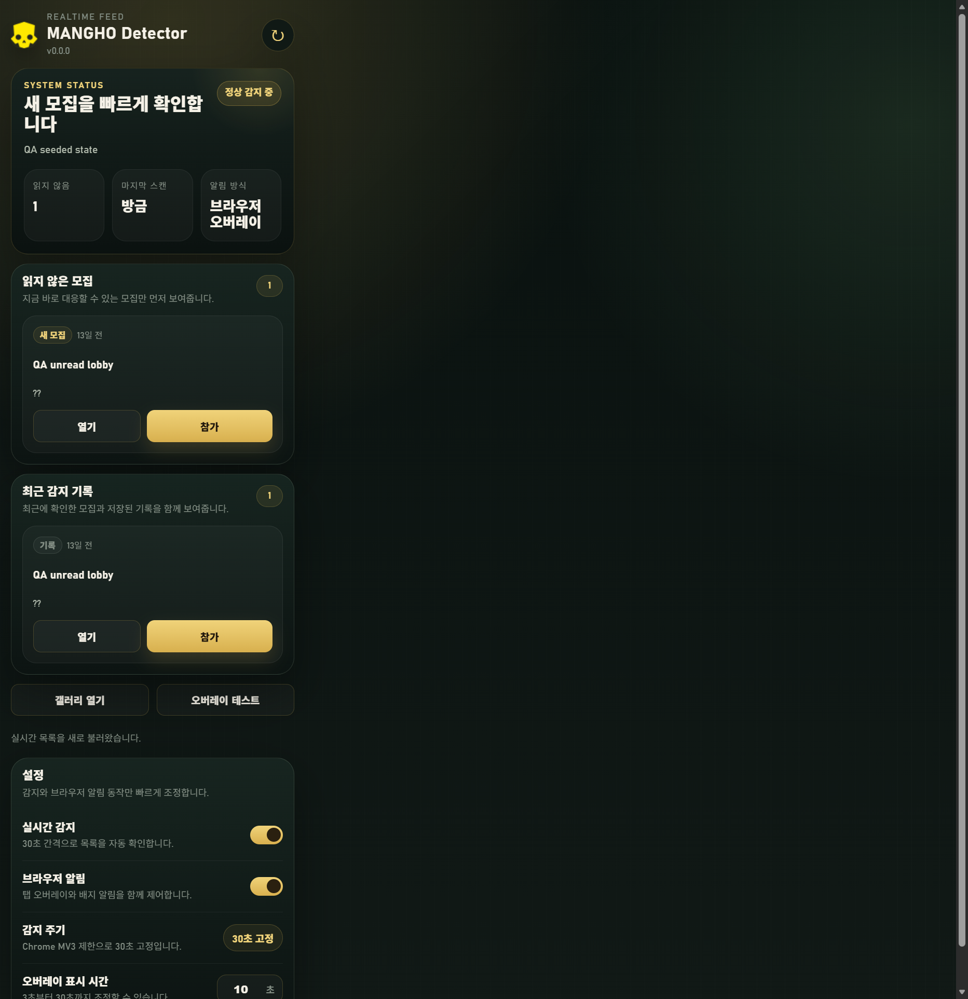

# MANGHO Detector

Helldivers 시리즈 갤러리의 `헬망호` 모집을 자동 감지하고, 지금 보고 있는 브라우저 탭 위에 바로 알려주는 Chrome 확장 프로그램입니다.

갤러리 목록의 빠른 `참가` 버튼, 활성 탭 오버레이, unread 큐, 최근 감지 기록을 하나의 흐름으로 묶어 놓친 모집을 줄이는 데 초점을 맞췄습니다.

## 주요 기능

### 1. 목록에서 바로 참가

헬다이버즈 시리즈 갤러리 목록에서 `헬망호` 글을 찾으면 제목 옆에 인라인 `참가` 버튼을 붙입니다. 글을 열지 않고도 바로 참가 흐름으로 들어갈 수 있습니다.

### 2. 백그라운드 감지

확장은 Chrome MV3 제약에 맞춰 30초 고정 주기로 새 모집을 확인합니다. 감지 대상은 `헬망호` 말머리와 최근 모집 조건을 만족하는 글입니다.

- 새 모집을 잡으면 unread 큐에 추가합니다.
- 최근 감지 기록을 저장합니다.
- 배지 숫자를 최신 상태로 맞춥니다.

### 3. 브라우저 오버레이 알림

Windows 알림 대신 브라우저 내부에서 끝내는 방식입니다. 현재 활성 탭이 일반 웹페이지라면 그 탭 위에 오버레이를 띄워 즉시 대응할 수 있게 합니다.

- `참가`
- `게시글 열기`
- `닫기`

제한된 탭에서는 오버레이 대신 확장 아이콘 배지와 팝업 대시보드로 fallback 합니다.

### 4. 팝업 대시보드

팝업은 단순 설정창이 아니라 현재 상태를 바로 처리하는 피드형 대시보드입니다.

- 읽지 않은 모집 우선 표시
- 최근 감지 기록 확인
- `모두 읽음`
- 갤러리 열기
- 오버레이 테스트

### 5. 빠른 설정

팝업 하단에서 아래 항목을 바로 조정할 수 있습니다.

- 실시간 감지 on/off
- 브라우저 알림 on/off
- 오버레이 표시 시간

## 설치

1. 이 저장소를 내려받습니다.
2. Chrome 또는 Edge에서 `chrome://extensions/` 또는 `edge://extensions/`를 엽니다.
3. `개발자 모드`를 켭니다.
4. `압축해제된 확장 프로그램을 로드합니다`를 눌러 이 폴더를 선택합니다.

현재 배포 방식은 소스 설치만 지원합니다.

## 권한

- `storage`
- `alarms`
- `tabs`
- `scripting`
- `http://*/*`
- `https://*/*`

활성 일반 웹탭 위에 오버레이를 띄우기 위해 넓은 호스트 권한을 사용합니다.

## 기술 스택

- Chrome Extension Manifest V3
- Vanilla JavaScript
- Chrome `alarms`, `tabs`, `storage`, `scripting`
- JSDOM 기반 테스트

## 프로젝트 구조

- `manifest.json`: MV3 설정
- `scripts/background.js`: 서비스 워커 진입점
- `scripts/shared/seaf-background-core.js`: 감지, unread, 배지, 알림 코어
- `scripts/content.js`: 갤러리 인라인 버튼과 목록 페이지 런타임
- `scripts/shared/seaf-overlay.js`: 공용 오버레이 렌더러
- `popup/`: 대시보드 UI
- `helper/`: 참가 링크 보조 흐름
- `docs/assets/`: GitHub README용 스크린샷

## 개발

- 의존성 설치: `npm install`
- 기본 테스트: `npm test`

테스트 파일:

- `test/background-core.test.js`
- `test/content-smoke.test.js`
- `test/popup-core.test.js`
- `test/popup-ui.test.js`
- `test/seaf-domain.test.js`

## 알려진 제한사항

- 브라우저 내부 페이지 같은 제한 탭에서는 오버레이를 주입할 수 없습니다.
- 이 경우 배지와 팝업 대시보드만 사용합니다.
- 현재 공식 배포는 `Load unpacked` 기준입니다.
- 이 머신에서는 일부 `node --test` 실행이 출력 없이 비정상 종료하는 환경 이슈가 있어 브라우저 실기 QA를 함께 사용했습니다.
